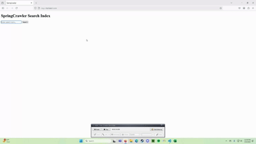

# Web Search Engine (Python, PyLucene, Flask)



This project was developed as part of **CS172: Introduction to Information Retrieval** at the University of California, Riverside.  
The goal was to design and implement a basic web search engine with crawling, deduplication, indexing, and ranked retrieval.

This fork highlights **my contributions** to the project:  
- Multithreaded Python crawler (~0.85 GB/hr throughput, 2.1 GB in 2.5 hrs)  
- SimHash-based duplicate detection (~20% fewer redundant pages indexed)  
- Flask web interface for delivering ranked search results  
- Enhancements to PyLucene indexing (scoring & field-based retrieval)

---

## Project Overview
- **Crawling:** Multithreaded Python crawler (Scrapy/requests + BeautifulSoup) with configurable parameters (seed, page limit, depth, output directory). Sustained throughput ~0.85 GB/hr (2.1 GB in 2.5 hrs).  
- **Parsing & Storage:** Extracted HTML content is cleaned and standardized into JSON for consistent indexing.  
- **Deduplication:** Implemented SimHash-based detection to eliminate ~20% of duplicate/near-duplicate pages, reducing redundancy and improving retrieval quality.  
- **Indexing & Retrieval:** PyLucene backend supports full-text indexing, relevance scoring, and field-based retrieval.  
- **Search UI:** Flask web application delivers ranked results in a clean, responsive interface.  
- **Execution:** Cross-platform scripts (Windows/Linux/Mac) simplify setup and crawler execution.

---

## Key Results
- **Crawl rate:** ~0.85 GB/hour sustained throughput.  
- **Deduplication:** ~20% fewer redundant documents in the index.  
- **Improved usability:** Flask UI enabled users to run ranked queries in a lightweight browser app.

---

## Instructions
### Requirements
- Python 3.9+  
- pip (latest version)  
- (Optional) virtual environment (recommended)

### Setup
```bash
# Clone repo
git clone https://github.com/JoshuaOcharan/web-search-engine.git
cd web-search-engine

# Create and activate virtual environment
python -m venv venv
source venv/bin/activate      # Windows: venv\Scripts\activate

# Install dependencies
pip install --upgrade pip
pip install -r requirements.txt
```
---

## Tools & Libraries
- **Languages:** Python
- **Frameworks:** Flask, PyLucene
- **Libraries:** BeautifulSoup, Requests, JSON
- **Techniques:** Multithreading, Web Crawling, SimHash, Full-Text Search, Deduplication

---

## Team
Developed by **Team 22** for CS172 (Spring 2025).
Contributors: Joshua Ocharan, Joshua Pennington, Cat Huyen Phan, Caden Leung
- [Original repository](https://github.com/CS-UCR/Spring-Crawler)
